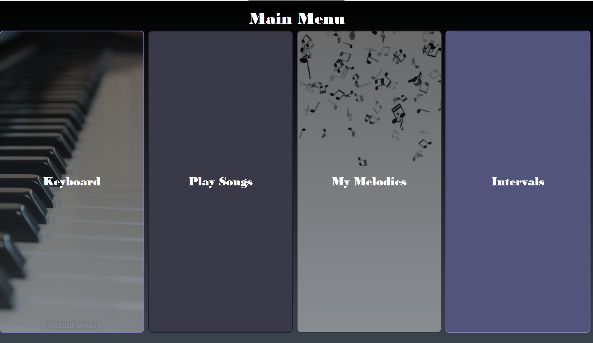
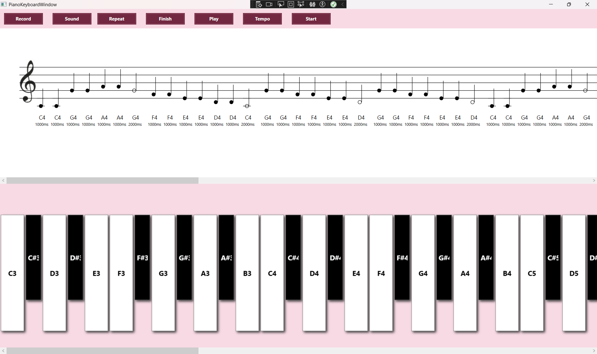
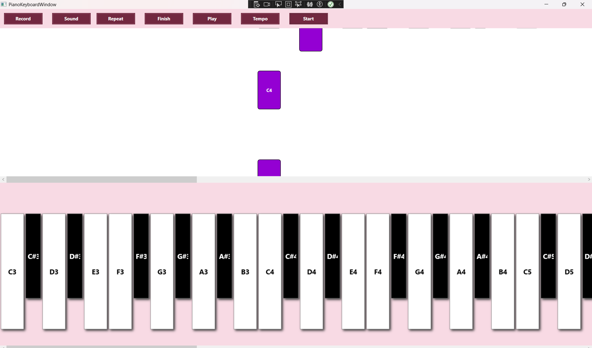
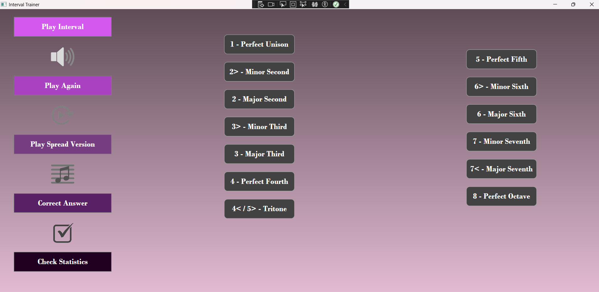

# PIANOAPP – Aplikacja do nauki gry na pianinie

PIANOAPP to aplikacja desktopowa stworzona w technologii WPF (C#), która łączy w sobie funkcje interaktywnego pianina, trenera interwałów oraz narzędzia do nauki i odtwarzania utworów. Aplikacja umożliwia wizualizację nut na pięciolinii oraz w formie "spadających bloczków" (tryb Waterfall), co pomaga w nauce czytania nut i rozpoznawaniu ich na klawiaturze.

## Spis treści

- [Opis projektu](#opis-projektu)
- [Kluczowe funkcje](#kluczowe-funkcje)
- [Zrzuty ekranu](#zrzuty-ekranu)
- [Szybki start](#szybki-start)

## Opis projektu

Głównym celem aplikacji jest wspomaganie procesu nauki gry na pianinie poprzez interaktywną zabawę z dźwiękiem. Użytkownik może:

- Grać na wirtualnej klawiaturze.
- Uczyć się rozpoznawać interwały muzyczne.
- Oglądać zapis nutowy wybranych utworów.
- Ćwiczyć grę w trybie "Waterfall", gdzie nuty "spadają" w kierunku klawiatury.
- Nagrywać własne melodie i odtwarzać je później.

Aplikacja wykorzystuje syntezę MIDI do generowania dźwięku, co pozwala na zmianę instrumentu (fortepian, organy, skrzypce).

## Kluczowe funkcje

- **Interaktywna klawiatura**: Klikalna klawiatura pianina z zakresu 7 oktaw.
- **Zapis nutowy**: Dynamiczne rysowanie nut i pauz na pięciolinii dla wybranego utworu.
- **Tryb Waterfall**: Wizualizacja utworu w formie spadających bloczków, które należy zagrać we właściwym momencie.
- **Trener interwałów**: Dwa tryby nauki interwałów – "Learn" (zgadywanie) i "Listen" (odtwarzanie po kliknięciu).
- **Odtwarzanie utworów**: Odtwarzanie zapisanych utworów z możliwością zmiany tempa.
- **Nagrywanie melodii**: Nagrywanie sekwencji nut granych na klawiaturze i zapisywanie ich jako nowy utwór.
- **Zmiana instrumentu**: Wybór instrumentu (Piano, Organy, Skrzypce) dla odtwarzanych dźwięków.

## Zrzuty ekranu

| Widok głównego menu | Widok klawiatury z pięciolinią |
| :-----------------: | :----------------------------: |
|  |  |

| Widok trybu Waterfall | Widok trenera interwałów |
| :-------------------: | :----------------------: |
|  |  |

## Szybki start

### Wymagania wstępne

- System operacyjny: Windows 10 lub nowszy.
- Zainstalowane środowisko uruchomieniowe **.NET 8.0** lub nowsze.
- Dowolne środowisko programistyczne (zalecany Visual Studio 2022) do kompilacji i uruchomienia.

